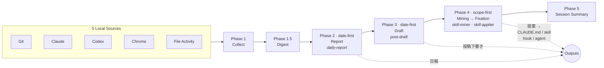

# DayTrace

> **AIエージェント ハッカソン 2026 提出作品**
> テーマ: **「一度命じたら、あとは任せろ」**

**証跡は、すでにそこにある。** Git のコミット、Claude のセッション、Chrome の閲覧履歴——あなたが毎日残しているローカルログを束ね、日報・投稿下書き・環境改善提案へと自動再構成します。

DayTrace は **ローカル完結・認証不要** の Claude Code plugin です。一言頼めば、収集から提案まで自律完走します。


## やること

`/daytrace-session` と一言頼むと、DayTrace は次を順に実行します。

1. **収集** — Git / Claude / Codex / Chrome / ファイル変更の 5 ソースから当日の証跡を取得
2. **日報生成** — 自分用・共有用の 2 バリアントを作成し `~/.daytrace/output/<date>/` に保存
3. **投稿下書き** — 条件を満たす日は、1 日の中心テーマを narrative draft に再構成
4. **パターン提案** — AI 履歴の反復パターンを抽出し、`CLAUDE.md` / `skill` / `hook` / `agent` への適用候補を提案

提案が気に入ったら、続けて `/skill-applier` で実ファイルに適用できます（diff 確認・承認フロー付き）。

## 実際の出力例

チャットには Phase 番号のメタ行は出さず、短い日本語の見出しと状態行で進捗を示します（`daytrace-session` の Chat Output Policy）。イメージは次のとおりです。

```
Git: 3 commits  Claude: 12 sessions  Chrome: 47 tabs
日報: report-private.md ✓  report-share.md ✓
投稿下書き: post-draft.md ✓（今日のテーマ: DayTrace スキル設計）
パターン提案: 候補内訳 適用 2 / 追加観測 0 / 観測ノート 1（合計 3）

## 提案（アクション候補）

1. git commit 前に lint を自動実行
   種類: 自動チェック（hook）
   確度: 高い — 複数セッション・複数ソースで繰り返し観測
2. daily-report の出力先を固定化
   種類: プロジェクト設定（CLAUDE.md）
   確度: 中程度 — 複数セッションで出現、もう少し定着を見たい

→ 続けて /skill-applier で適用できます
```

各提案には **根拠（evidence）と確度（チャット上は日本語の確度行）** が付きます。見送った提案は decision log に残り、証跡が蓄積されれば次回あらためて再浮上します。

## インストール

```bash
claude plugin add github:matz-d/daytrace-plugin
```

設定不要。外部へのデータ送信なし。

## 使い方

Claude Code で

```
/daytrace-session
```

自然言語でも起動できます:

- `今日の振り返りをお願い`
- `1日のまとめをして`
- `今日の活動を整理して`

### `/daytrace-session` の言い方と、何が変わるか（ユーザー目線）

コマンドラインの引数ではなく、**会話で次のような意図を足す**と、裏側のセッションがそれに合わせて動きます（エージェントがスキル契約に沿って解釈します）。

**どの日をまとめるか**

- 「**昨日**」「**一昨日**」「**3月20日**」のように日付を言うと、その暦日を軸に日報・投稿下書き・（パターン提案の）観測の基準日が揃います。何も言わない場合は、いまの時刻から見た「今日」が起点です。
- **深夜早朝の「今日」**について: ローカル時刻で **午前 6 時より前**は、日報まわりの「報告日」が **前日の暦日**として扱われます（夜ふかしセッションを前日に寄せるルール）。「今日」と言ったつもりでも、時刻によっては出力フォルダの日付が前日になり得ます。

**観測を広げるか、今の作業場所に寄せるか**

- 何も付けない標準の統合セッションは、手順上 **Claude / Codex の履歴は作業ディレクトリをまたいで拾いやすい**動きになります。他リポで触ったセッションの話題も、日報や提案の材料に乗りやすくなります。
- 「**このリポだけ**」「**今開いているプロジェクトに限定**」「**いまのフォルダ基準で**」のように言うと、**AI 履歴の候補をいまの作業場所の近くに寄せる**方向になります（パターン提案では、外のディレクトリ由来の塊が薄くなりがちです）。
- 「**オールセッション**」「**他のプロジェクトの Claude も含めて**」「**端末全体の履歴で**」のように言うと、**横断的な観測**が明示的になります。ただし **Git のコミット**や **ワークスペース上のファイル作業の痕跡**は、基本的に **いま Claude Code が見ているリポジトリ（または会話で指定したパス）** を軸にしたままです。「全部のリポの Git を一度に読む」モードではありません。

**別リポジトリ向けの提案が出ること**

- 観測を狭めても、履歴の中に **別ディレクトリ・別リポで繰り返していた作法**が残っていると、パターン提案に **「別リポジトリ向け」** と分かる表示が付くことがあります。適用先を取り違えないための表示です。

## どう動くか



処理の軸は 2 種類あります。

- **date-first** — 1 日を軸に活動を再構成する（日報・投稿下書き）
- **scope-first** — 7〜30 日の観測窓で反復パターンを抽出する（パターン提案）

ソースが欠けても止まらず、取得できたデータだけで最後まで進みます（**Graceful Degrade**）。

### 5つのスキル

| スキル | 役割 |
|--------|------|
| `/daytrace-session` | 全フェーズを一言で自律完走する統合入口 |
| `/daily-report` | その日の活動を日報に再構成 |
| `/post-draft` | 1 日の中心テーマを投稿下書きに再構成 |
| `/skill-miner` | AI 履歴から反復パターンを抽出し適用候補を提案 |
| `/skill-applier` | 提案を `CLAUDE.md` / `skill` / `hook` / `agent` に適用 |

## データソース

ローカルに既にある証跡のみを読みます。**OAuth・クラウド API は使いません。**

| ソース | 対象 |
|--------|------|
| `git-history` | Git コミット + worktree snapshot |
| `claude-history` | `~/.claude/projects/**/*.jsonl` |
| `codex-history` | `~/.codex/history.jsonl` |
| `chrome-history` | Chrome History DB（読み取り専用コピー） |
| `workspace-file-activity` | untracked ファイル変更 |

## 設計判断

### なぜ「ローカル完結」か

OAuth やクラウド API に依存する source はコアに含めない、という判断をしました。トークン管理と「設定不要」を同時に満たせないからです。SaaS への自動投稿・テンプレ差し込みは別スキルや手動に任せ、DayTrace は **ローカルに読める成果物まで**を責務とします。

### なぜ「2つの軸」か

同じローカル証跡を、用途に応じて 2 つのルートで処理します。

- **date-first** — 「今日何をしたか」を日報・投稿下書きに再構成。報告日ルール（06:00 未満は前日の暦日扱い）を適用
- **scope-first** — 「最近ずっと同じことをしている」パターンを 7〜30 日窓で抽出。repo 向け提案と個人横断向け提案は別軸（`workspace-local` / `global-personal`）で区別

### なぜ「提案に根拠と確信度」か

LLM の出力をそのまま適用させない、という方針です。各提案には evidence（どのセッションで何回出現したか）と、候補単位の **確度**（内部的には `strong` / `medium` / `weak` など。表示は「確度: 高い / 中程度 / まだ弱い」）を付け、ユーザーが承認するかどうかを判断できるようにします。集約イベント側の `confidence`（`high` / `medium` / `low`）とは別レイヤーです。見送ってもログに残るので、証跡が蓄積されれば自動で再浮上します。

## ハッカソン審査基準へのアプローチ

### 自律性 — 最後まで進む

DayTrace の自律性は「質問しない」ことではなく、**最後まで進めること** にあります。

- 一度頼むと、収集・日報・下書き・提案まで自律完走
- ソースが欠けても止まらない（Graceful Degrade）
- 人の判断を仰ぐのは、共有範囲の確認・適用の承認など **影響の大きい決定だけ**

### クオリティ — 根拠のある提案

- date-first / scope-first の 2 軸で、同じデータを用途別に再構成
- 提案には evidence + 候補の確度（表示は日本語の確度行）を付け、LLM 出力の信頼性を担保
- チャットでは番号付きのコンパクトな一覧、詳細は `proposal.md` など artifact で使い分け

### インパクト — 使うほど、環境が育つ

- 提案は `CLAUDE.md` / `skill` / `hook` / `agent` への適用候補として返る
- 見送った提案も decision log に残り、証跡が蓄積されれば再浮上
- 使い続けるほど、反復作業が自動化され、開発環境が自分仕様に育っていく

## 動作要件

- Python 3.9+（標準ライブラリのみ。追加パッケージ不要）
- Git
- macOS または Linux

## License

MIT
