# DayTrace

> **AIエージェント ハッカソン 2026 提出作品**  
> テーマ: **「一度命じたら、あとは任せろ」**

**一度頼めば、観測から提案まで自律完走。**  
DayTrace は、ローカル証跡を集めて 1 日を再構成し、反復パターンを抽出し、次の改善候補まで返す Claude Code plugin です。



## 何ができるか

`/daytrace-session` と一度頼むと、DayTrace は次を順に実行します。

1. Git / Claude / Codex / Chrome / file activity から、その日の証跡を収集
2. 日報を生成
3. AI 履歴から反復パターンを抽出し、固定化候補を提案
4. 必要条件を満たす日は、投稿下書きまで生成

返ってくるのは、単なるログ一覧ではありません。

- **自分用日報**: 後で振り返れる形に再構成
- **共有用日報**: 第三者に見せやすい進捗報告
- **パターン提案**: `CLAUDE.md` / `skill` / `hook` / `agent` の固定化候補
- **投稿下書き**: その日の中心テーマを 1 本の narrative として整理

## ハッカソン審査基準へのアプローチ

### 自律性

DayTrace の自律性は、単に「質問しない」ことではなく、**最後まで進めること** にあります。

- 一度頼むと、収集から日報・提案・下書きまで自律完走
- source が欠けても止まらず、利用可能な証跡だけで継続
- 人に返すのは、共有境界や固定化判断など、責任のある場面だけ

### クオリティ

同じローカル証跡を、用途に応じて 2 つのルートで使い分けます。

- **date-first**: 日報 / 投稿下書き向け
- **scope-first**: スキル抽出向け

各提案には evidence と confidence を付け、LLM の暴走を抑えながら人が読める出力へ整えます。

### インパクト

- 提案は `CLAUDE.md` / `skill` / `hook` / `agent` への固定化候補として返る
- 見送られた提案も decision log に残る
- 証跡が蓄積すれば、次回あらためて候補として再浮上できる

## 試し方

### 1. インストール

```bash
claude plugin add github:matz-d/daytrace-plugin
```

設定は不要です。外部へのデータ送信は一切ありません。

### 2. 実行

```bash
/daytrace-session
```

あるいは自然言語で、

- `今日の振り返りをお願い`
- `1日のまとめをして`
- `全部やって`

のように頼むだけでも開始できます。

### 3. 実行すると返るもの

1. DayTrace ダイジェスト
2. 日報
3. パターン提案
4. 投稿下書き
5. セッション要約

## どう動くか

```text
observe ──→ project ──→ extract ──→ propose ──→ apply
  │            │            │           │          │
  │        date-first   scope-first  decision    CLAUDE.md
  │        ┌─────┐     ┌─────┐       log        skill / hook
  │        │daily │     │skill│                    agent
  │        │report│     │miner│
  │        │post  │     └─────┘
  │        │draft │
  │        └─────┘
  │
5 local sources
(git, claude, codex, chrome, file-activity)
```

### 5つのスキル

| スキル | 主軸 | 役割 |
|--------|------|------|
| `/daytrace-session` | orchestration | 一言で全フェーズを自律完走する統合入口 |
| `/daily-report` | date-first | その日の活動を日報ドラフトに再構成 |
| `/post-draft` | date-first | 1 日の中心テーマを narrative draft に再構成 |
| `/skill-miner` | scope-first | AI 履歴から反復パターンを抽出し固定化候補を提案 |
| `/skill-applier` | fixation | 提案を `CLAUDE.md` / `skill` / `hook` / `agent` に固定化 |

## データソース

収集対象は **ローカルデータのみ** です。

| ソース | 対象 | スコープ |
|--------|------|----------|
| `git-history` | Git コミット + worktree snapshot | workspace |
| `claude-history` | `~/.claude/projects/**/*.jsonl` | all-day |
| `codex-history` | `~/.codex/history.jsonl` | all-day |
| `chrome-history` | Chrome History DB の読み取り専用コピー | all-day |
| `workspace-file-activity` | untracked ファイル変更 | workspace |

## 動作要件

- Python 3.x
- Git
- macOS または Linux

追加パッケージ不要。Python 標準ライブラリのみで動作します。

## License

MIT
