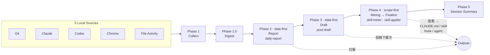

# DayTrace

> **AIエージェント ハッカソン 2026 提出作品**  
> テーマ: **「一度命じたら、あとは任せろ」**

**一度頼めば、観測から提案まで自律完走。**

DayTrace は、**ローカル完結・認証不要**で Git / AI ログなどの証跡を構造化し、**報告日を軸に日報・投稿下書きを再構成**し、**反復パターンを CLAUDE.md・skill・hook・agent 向けに提案**する Claude Code plugin です。生成した Markdown は **`~/.daytrace/output/<report_date>/`** へ保存。チャットには要約と保存状況・提案の compact 表を表示します。

さらに **`/skill-applier`** を使えば、提案を実ファイルへそのまま適用できます（diff 確認・承認後の CLAUDE.md 追記、hook/agent の生成、公式 skill-creator への handoff）。


## 何ができるか

`/daytrace-session` と一度頼むと、DayTrace は次を順に実行します。

1. Git / Claude / Codex / Chrome / file activity から、その日の証跡を収集
2. 日報を生成（自分用 → 共有用）
3. 必要条件を満たす日は、投稿下書きを生成
4. AI 履歴から反復パターンを抽出し、適用候補を提案（続けて `/skill-applier` で実適用可）

**主な artifact（単一日・`report_date` ありのとき）:**

- **`report-private.md`** — 自分用日報
- **`report-share.md`** — 共有用日報
- **`post-draft.md`** — 投稿下書き（条件付き）
- **`proposal.md`** — パターン提案の詳細版（compact 表は chat）

**日付・観測スコープ**: 対象日は引数やプロンプトで指定できる。未指定時は「報告日」ルール（ローカル **06:00 未満は前日の暦日**）に従う。aggregate / 日報系は **カレントディレクトリを workspace** とみなすのが基本（`--workspace` で明示可）。**`--all-sessions`** は Claude / Codex 等の **観測を広げる**スイッチであり、適用先を自動で決めるものではない。広く観測しても **repo 向け提案と個人横断向け提案は別軸**（`workspace-local` / `global-personal`）で区別する（詳細は `docs/output-polish.md` §2）。

**適用（`/skill-applier`）**: 提案の種類ごとに導線がある。`CLAUDE.md` は diff preview から追記、`skill` は scaffold から **公式 skill-creator への handoff**、`hook` / `agent` は設計案の承認後に guided creation でファイル生成（`skills/skill-applier/SKILL.md`）。

**認証と配布の境界**: OAuth やクラウド API に依存する source は **コアに含めない**（トークン管理と「設定不要」を両立できないため）。SaaS への自動投稿やテンプレ差し込みは **artifact の外**（別 skill・手動）に任せ、DayTrace は **ローカルに読める成果物**までを責務とする。

## ハッカソン審査基準へのアプローチ

### 自律性

DayTrace の自律性は、単に「質問しない」ことではなく、**最後まで進めること** にあります。

- 一度頼むと、収集から日報・下書き・提案まで自律完走
- source が欠けても止まらず、利用可能な証跡だけで継続
- 人の判断を仰ぐのは、共有範囲の確認や適用の承認など、影響の大きい決定だけ

### クオリティ

同じローカル証跡を、用途に応じて 2 つのルートで使い分けます。

- **date-first**: 日報 / 投稿下書き向け
- **scope-first**: スキル抽出向け

各提案には根拠（evidence）と確信度（confidence）を付け、LLM 出力の信頼性を担保しつつ人が読める形に整えます。

### インパクト

毎日の振り返りが、開発環境の改善サイクルに直結します。

- 提案は `CLAUDE.md` / `skill` / `hook` / `agent` への適用候補として返る
- ユーザーが見送った提案も decision log に残り、証跡が蓄積すれば次回あらためて再浮上する
- 使い続けるほど、反復作業が自動化され、開発環境が自分に合った形に育っていく

## 試し方

### 0. 動作要件

- Python 3.9+（標準ライブラリのみ。追加パッケージ不要）
- Git
- macOS または Linux

### 1. インストール

```bash
claude plugin add github:matz-d/daytrace-plugin
```

設定は不要です。外部へのデータ送信は一切ありません（ローカル完結）。

### 2. 実行

```bash
/daytrace-session
```

あるいは自然言語で、

- `今日の振り返りをお願い`
- `1日のまとめをして`
- `今日の活動を整理して`

のように頼むだけでも開始できます。

### 3. 実行すると返るもの

1. DayTrace ダイジェスト
2. 日報（自分用・共有用の保存状況）
3. 投稿下書き（条件付き）
4. パターン提案（compact 表など）
5. セッション要約（mixed-scope 注記と再構成元を含む）

チャットには `[DayTrace]` プレフィックスを出さない。複数日レンジで集計した場合は `report_date` / 単一 `output_dir` が付かないことがある（`docs/output-polish.md` §7）。

## どう動くか



- **date-first**: 1 日を軸に活動を再構成する（日報・投稿下書き）
- **scope-first**: 観測窓（7〜30 日）で反復パターンを抽出する（パターン提案）
- ソースが欠けても止まらず、取得できたデータだけで最後まで進む（Graceful Degrade）

### 5つのスキル

| スキル | 主軸 | 役割 |
|--------|------|------|
| `/daytrace-session` | orchestration | 一言で全フェーズを自律完走する統合入口 |
| `/daily-report` | date-first | その日の活動を日報ドラフトに再構成 |
| `/post-draft` | date-first | 1 日の中心テーマを narrative draft に再構成 |
| `/skill-miner` | scope-first | AI 履歴から反復パターンを抽出し適用候補を提案 |
| `/skill-applier` | apply | 提案を `CLAUDE.md` / `skill` / `hook` / `agent` に適用 |

## データソース

収集対象は **ローカルに既にある証跡のみ** です。**OAuth やクラウド API 認証が必要なソースは含めない**（プラグイン側でトークンを扱わず、ネットワーク送信も行わない方針のため）。

| ソース | 対象 | スコープ |
|--------|------|----------|
| `git-history` | Git コミット + worktree snapshot | workspace（通常は cwd） |
| `claude-history` | `~/.claude/projects/**/*.jsonl` | all-day（`--all-sessions` で観測拡張） |
| `codex-history` | `~/.codex/history.jsonl` | all-day |
| `chrome-history` | Chrome History DB の読み取り専用コピー | all-day |
| `workspace-file-activity` | untracked ファイル変更 | workspace（通常は cwd） |

## License

MIT
